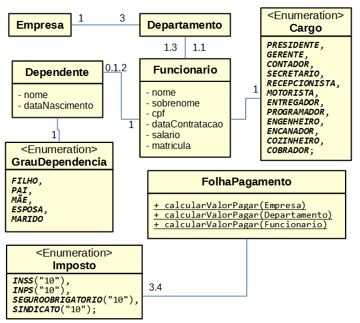

Trabalho 1 - Questão 1 - Disciplina de Introdução a Programação Orientada a Objetos
Curso de Graduação em Sistemas para Internet - UTFPR TD.

DESCRIÇÃO: Arquivo original [aqui](pdf/trabalho1.pdf)
2. Desenvolva um sistema para gerenciamento de Recursos Humanos de uma empresa. O sistema deve ser capaz de realizar cadastros de funcionários e calcular o valor a ser pago na folha de pagamentos. O sistema deve implementar o seguinte diagrama de classes: 

O sistema deve garantir as seguintes regras de negócio:
1. Funcionários podem declarar no máximo 2 dependentes.
2. Não deve ser possível cadastrar dependentes declarados como FILHO com idade
superior a 18 anos.
3. Funcionários devem receber o acréscimo de 105.99 para cada dependente declarado.
4. Funcionários devem receber o acréscimo de 100.00 para cada ano completo trabalho.
5. A folha de pagamento deve descontar o percentual de impostos do salário do
funcionário.
6. Os seguintes impostos são aplicados a todos os funcionários: INSS (10% do valor do
salário), INPS (10% do valor do salário) e Seguro Obrigatório (10% do valor do salário).
7. Apenas funcionários com cargo de Engenheiro pagam o imposto do sindicato (10% do
valor do salário).
8. A empresa possui exatamente 3 departamentos (Gerencia, Operações, Pesquisa e
Desenvolvimento)
9. Funcionários devem ser obrigatoriamente vinculados a um departamento.

Para executar o arquivo compactado digite no terminal
`` java -jar sistemaRh.java ``
